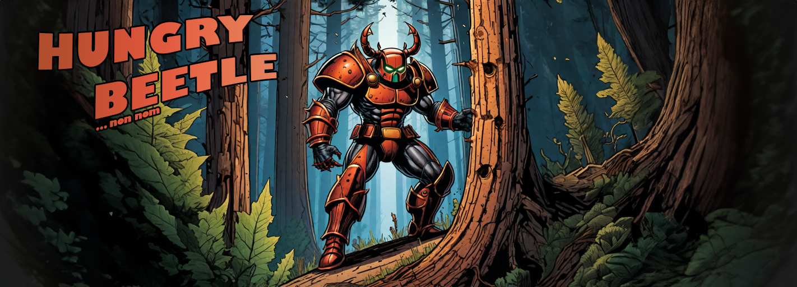

# Hungry Beetle

*(Banner generated with https://hotpot.ai/art-generator)*

Note that current development is being done in https://github.com/ForestPulse/hungry-beetle

Beetle hungry.

Run with ``./feed-beetle.sh``

Nom nom.

Beetle happy.

## Requirements

### Software

- Nextflow
- Docker

### Data

- a FORCE Level 2 data cube
- GIS layer for area of interest
- GIS layer for analysis area OR already cubed raster masks

see ``beetle.config`` for parameterization

(C) David Frantz 2024
